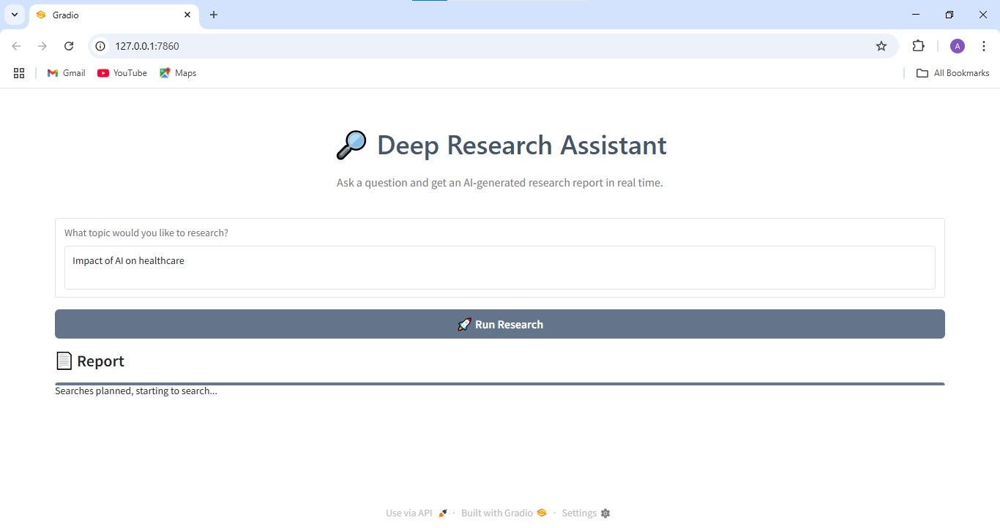

# Deep Research Assistant 🔎

## Description

Deep Research Assistant is an intelligent, AI-driven tool designed to streamline and automate the process of in-depth research. Built with Python and leveraging the **OpenAI Agent SDK**, it harnesses a suite of collaborative AI agents that plan targeted web searches, extract and summarize information, generate comprehensive reports, and deliver results directly via email — all in real time.

Simply enter a research query through the intuitive web interface, and the assistant takes care of everything else: crafting optimized search strategies, performing web searches, synthesizing findings into a detailed markdown report, and sending the final report to your inbox. This enables faster, more accurate, and more efficient research workflows without manual overhead.

## Key Features

- **Automated Search Planning:** Dynamically generates relevant and timely search queries based on your input and current context.
- **Efficient Web Search & Summarization:** Integrates with the Google Serper API to gather and distill essential information from the web.
- **Detailed Report Generation:** Produces multi-page, well-structured markdown reports suitable for professional use.
- **Email Delivery Service:** Converts markdown reports into elegant HTML emails and sends them using SendGrid, with customizable recipients.
- **Real-time Interactive UI:** Built with Gradio, providing instant feedback and streaming of progress and results.
- **Asynchronous Agent Orchestration:** Executes multiple agents in parallel to speed up the research pipeline and improve responsiveness.

## Dependencies

The project relies on the following Python libraries:

* `openai`
* `langchain-community`
* `sendgrid`
* `gradio`
* `pydantic`
* `dotenv`
* `certifi`
* `agents`
* `typing`

##  Project Structure

```text
├── .env                        # Environment variables (API keys for OpenAI, Serper, SendGrid)
├── deep_research.py            # Main Gradio app launching the interactive research UI
├── emailer_agent.py            # Agent for formatting and sending research reports via email
├── planner_agent.py            # Agent responsible for generating optimized search queries
├── README.md                   # Project documentation and overview
├── requirements.txt            # Python package dependencies
├── research_manager.py         # Orchestrator coordinating the entire research workflow asynchronously
├── search_agent.py             # Agent performing web searches and summarizing results
└── writer_agent.py             # Agent composing detailed markdown research reports
```

## How It Works

**Planning Searches:**
The Planner Agent interprets your query and creates a set of targeted search terms, ensuring results are current and relevant.

**Executing Searches:**
The Search Agent performs web searches asynchronously using the Google Serper API and summarizes the top findings concisely.

**Writing Reports:**
The Writer Agent compiles the summarized data into a coherent, extensive markdown report — 5 to 10 pages long with structured insights.

**Sending Emails:**
The Email Agent converts the markdown report to polished HTML and sends it to your specified email or a default address.

**User Interaction:**
The Gradio app streams live updates of each step, allowing you to monitor progress and receive the final report instantly.

## Key Takeaways

Building the Deep Research Assistant gave me hands-on experience with designing and orchestrating AI agents in a modular, asynchronous system. Here's a summary of key takeaways from this project:

- **OpenAI Agent SDK:** Learned how to define, configure, and coordinate multiple AI agents using OpenAI’s new Agent SDK — enabling each agent to perform a focused role in a larger collaborative pipeline.

- **Asynchronous Programming:** Gained practical experience with `asyncio` in Python to run tasks concurrently, improving the responsiveness and performance of the app.

- **LangChain & Tool Integration:** Integrated web search tools like **Google Serper API** and email delivery via **SendGrid**, and learned how to wrap them as function tools for agents to use.

- **Structured Output with Pydantic:** Used Pydantic models to validate and enforce structured data exchange between agents, ensuring predictable and robust outputs.

- **Gradio Interface Design:** Built a clean, real-time web interface with Gradio to let users interact seamlessly with the backend research engine.

- **Streaming Results to UI:** Implemented real-time progress streaming from backend to frontend, keeping the user informed during long-running research workflows.

- **Modular Design Thinking:** Learned to separate responsibilities across different agents and files, making the system easier to test, extend, and maintain.

This project helped me build a deeper understanding of agent-based systems, multi-modal API integration, and delivering AI capabilities in a user-friendly, production-ready form.

## User Interface Preview



*A clean and intuitive interface that streams real-time research progress and results.*

## Author

**Atharv Pede**  
📧 [atharvpede1234@gmail.com](atharvpede1234@gmail.com)  
🔗 [LinkedIn](https://www.linkedin.com/in/atharv-pede-43b757197?lipi=urn%3Ali%3Apage%3Ad_flagship3_profile_view_base_contact_details%3B0y0Eo3%2FTQye%2FJGg4X12w8w%3D%3D)